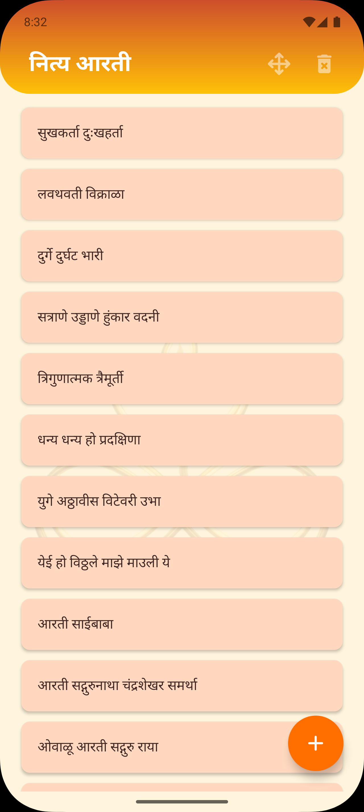
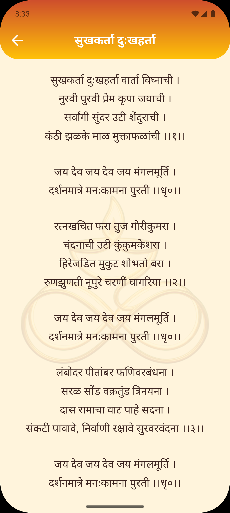
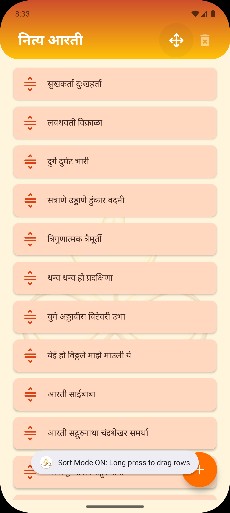
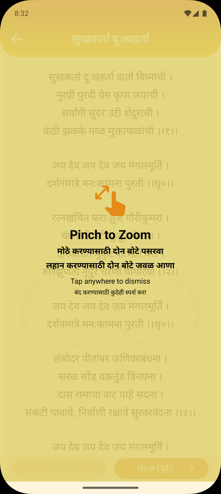

# Nitya Aarti - नित्य आरती 🕉️

**Nitya Aarti - नित्य आरती** is a modern, lightweight Android application designed to provide a seamless reading experience for daily Aartis, Mantras, and Stotras in Marathi. Built with Kotlin, it focuses on user customization, readability, and ease of use.

## ✨ Features

* **📖 Read Aartis:** Clean, readable lyrics for popular Marathi Aartis (Ganpati, Durga Mata, Shankar, etc.).
* **🔍 Pinch-to-Zoom:** Intuitive pinch gestures to increase or decrease text size for better readability. Includes a "Smart Tip" overlay that guides new users.
* **↕️ Drag & Drop Sorting:** Users can reorder their Aarti list according to their prayer routine using a dedicated Sort Mode.
* **➕ Add Custom Aartis:** Users can add their own Aartis or Mantras to the app.
* **❌ Manage List:** Easily delete unwanted Aartis with a toggleable Delete Mode.
* **💾 Persistent Storage:** App remembers the custom order, added Aartis, and text size preferences using local storage.
* **🎨 Custom Splash Screen:** Beautiful, branded launch experience that transitions seamlessly to the main app.
* **🌑 User-Friendly UI:** Saffron-themed interface designed for a spiritual look and feel.

## 📱 Screenshots

| Home Screen | Read Aarti | Drag & Drop | Zoom Tip |
|:-----------:|:----------:|:-----------:|:--------:|
|  |  |  |  |

## 🛠️ Tech Stack

* **Language:** Kotlin
* **Platform:** Android (Min SDK 24)
* **UI Components:**
    * `RecyclerView` with `ItemTouchHelper` (for Drag & Drop)
    * `ConstraintLayout` & `LinearLayout`
    * `CardView`
* **Storage:** `SharedPreferences` (for settings) & `JSON` (for data persistence)
* **Architecture:** MVC (Model-View-Controller)

## 🚀 How to Run

1.  **Clone the repository:**
    ```bash
    git clone [https://github.com/shubhamghadi123/nitya-aarti.git](https://github.com/shubhamghadi123/nitya-aarti.git)
    ```
2.  **Open in Android Studio:**
    * File -> Open -> Select the cloned folder.
3.  **Sync Gradle:**
    * Let Android Studio download the necessary dependencies.
4.  **Run:**
    * Connect your device or start an emulator and click the **Run** (▶️) button.

## 📂 Project Structure

* `MainActivity.kt` - Handles the main list, drag-and-drop logic, and mode toggling.
* `ReadAartiActivity.kt` - Handles the reading view, zoom logic, and "Smart Tip" overlay.
* `SplashActivity.kt` - Manages the startup branding and transition.
* `AartiStorage.kt` - Helper object to save and load data locally.
* `HomeAdapter.kt` - RecyclerView adapter handling list items and click/drag events.

## 🤝 Contact

Developed by **Prime Labs**
📧 Email: labsprime.dev@gmail.com
